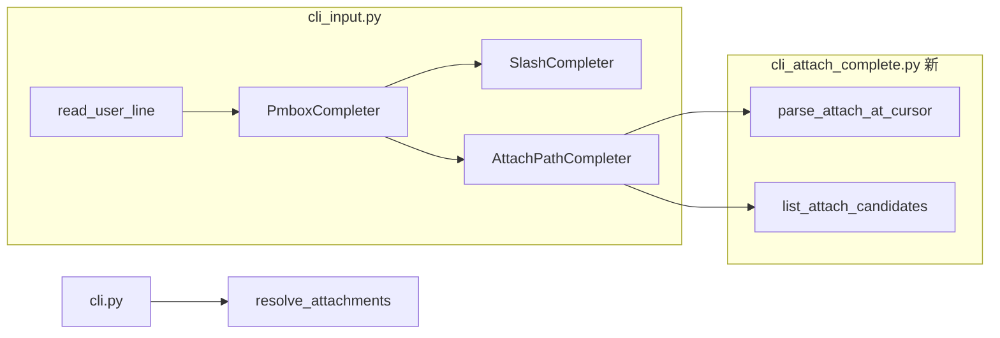

# `@` 路径补全实现计划

## 背景

当前 [`src/pm_agent/cli_input.py`](src/pm_agent/cli_input.py) 仅有 `SlashCompleter`（`/help` 等）。`@` 解析与读盘已在 [`src/pm_agent/cli_attach.py`](src/pm_agent/cli_attach.py) 完成，但**输入阶段无文件列表**。

本迭代补齐：**TTY 下打 `@` 即出现可选列表**（你已确认范围：**仅 `.md`/`.txt` 文件 + 可进入的子目录**）。

## 目标体验

```text
> 下周立项 @
  doc/              目录
  docs/             目录
  README.md         文件
  ...

> 下周立项 @doc/
  需求孵化.md       文件
  ...

> 下周立项 @doc/需求孵化.md
[attach] ok  需求孵化.md  (2KB)
● …推荐结果…
```

- 与 Claude Code 一致：**边输入边选**，不是发送后才解析
- 选中路径后仍由现有 `resolve_attachments` 校验与注入（行为不变）
- 非 TTY / 管道输入：无补全，行为与现在相同

## 架构



**职责拆分（遵循现有「纯函数 + 薄集成」模式）：**

| 模块 | 职责 |
|------|------|
| [`src/pm_agent/cli_attach_complete.py`](src/pm_agent/cli_attach_complete.py)（新） | 光标处 `@` 片段解析、目录枚举、候选过滤（纯函数，可单测） |
| [`src/pm_agent/cli_input.py`](src/pm_agent/cli_input.py) | `AttachPathCompleter` + `PmboxCompleter`；`read_user_line` 换用组合补全器 |
| [`src/pm_agent/cli_attach.py`](src/pm_agent/cli_attach.py) | 仅导出/复用 `_ALLOWED_SUFFIX`（或 `ALLOWED_ATTACH_SUFFIXES` 常量），避免两处维护扩展名 |
| [`src/pm_agent/cli.py`](src/pm_agent/cli.py) | WELCOME/HELP 补一句「`@` 可 Tab 选文件」 |

**不改动：** `resolve_attachments` 逻辑、Agent 工具、自动扫盘。

## 核心算法

### 1. 判断是否在 `@` 补全上下文（`parse_attach_at_cursor`）

输入：`text_before_cursor: str`

输出：`AttachPartial | None`，含：
- `prefix: str` — `@` 之后、光标前的路径片段（不含 `@`）
- `replace_start: int` — 从该行哪个字符位置开始替换（`@` 后第一个路径字符；裸 `@` 时为 `@` 后位置）

规则：
- 从光标向左找**当前正在编辑**的 `@` 提及（支持行内多处 `@`，以光标所在 token 为准）
- 引号路径 `@"..."` / `@'...'`：在引号内也补全（v1 支持）
- **邮箱不误触发**：复用 [`looks_like_attach_path`](src/pm_agent/cli_attach.py) — 仅当 `@` 后片段已像路径（含 `/`、`./`、`../`、或以 `.md`/`.txt` 结尾）或刚输入裸 `@` 时激活
- 行首 `/` 元指令场景：若整段输入以 `/` 开头，**不**走 `@` 补全（与现网一致）

### 2. 枚举候选（`list_attach_candidates`）

输入：`prefix: str`, `cwd: Path`, `limit: int = 50`

步骤：
1. 将 `prefix` 拆为 `base_dir` + `name_prefix`（处理 `./docs/foo` → base=`cwd/docs`, prefix=`foo`）
2. 绝对路径以 `/` 开头时，base 用绝对目录解析
3. 读取 `base_dir`（不存在/非目录 → 空列表）
4. 目录项过滤：
   - **文件**：后缀在 `ALLOWED_ATTACH_SUFFIXES`（`.md`, `.txt`，大小写不敏感）
   - **目录**：可进入且**非隐藏目录**（名称不以 `.` 开头；跳过 `__pycache__`、`.venv` 等）
   - 名称以 `name_prefix` 做前缀匹配（大小写不敏感）
5. 排序：目录在前，再按名称字母序；截断至 `limit` 条
6. 返回 `AttachCandidate(path_text, kind=file|dir, display_meta)`

插入规则（`Completion`）：
- 目录候选插入时带尾部 `/`，便于继续向下导航
- `start_position` 替换从 `replace_start` 到光标的片段

### 3. 组合补全器（`PmboxCompleter`）

优先级：
1. `text_before_cursor.lstrip().startswith("/")` → 仅 `SlashCompleter`
2. `parse_attach_at_cursor(...) is not None` → `AttachPathCompleter`
3. 否则无补全

`read_user_line` 保持：`complete_while_typing=True`, `CompleteStyle.COLUMN`（与 slash 一致，列表竖排）。

## 测试计划（TDD）

新建 [`tests/test_cli_attach_complete.py`](tests/test_cli_attach_complete.py)：

| 用例 | 断言 |
|------|------|
| 裸 `@` | 列出 cwd 下 md/txt 与目录 |
| `@doc/` | 列出 `doc/` 子项 |
| `@./README` | 前缀过滤 |
| `@user@x.com` | 不进入补全上下文 |
| 行首 `/help` | 不触发 attach 补全 |
| 隐藏目录 `.git` | 不出现在列表 |
| `pyproject.toml` | 不出现（非 md/txt） |
| 目录 `kickoff.md`（无扩展名目录） | 作为目录出现（与 load 行为一致） |

扩展 [`tests/test_cli_input.py`](tests/test_cli_input.py)：

- `PmboxCompleter` 在 `@` 上下文 yield 候选
- `/h` 仍只 yield `/help`（slash 优先）
- 非 TTY 回退不变

## 文档与变更记录

- [`src/pm_agent/cli.py`](src/pm_agent/cli.py) WELCOME/HELP：增加「输入 `@` 可 Tab 选择 `.md`/`.txt`」
- [`README.md`](README.md)：补一句交互说明
- [`doc/agent_learn.md`](doc/agent_learn.md)：新增功能记录
- [`doc/后续迭代注意点.md`](doc/后续迭代注意点.md)：删除或勾掉第 4 条「`@` 路径 Tab 补全」

## 实现步骤（建议顺序）

### Task 1：纯函数 `cli_attach_complete.py`
- 从 `cli_attach` 抽出 `ALLOWED_ATTACH_SUFFIXES` 常量（两处 import）
- 实现 `parse_attach_at_cursor` + `list_attach_candidates`
- 先写 `tests/test_cli_attach_complete.py` 全绿

### Task 2：接入 `prompt_toolkit` 补全
- 实现 `AttachPathCompleter`、`PmboxCompleter`
- 修改 `read_user_line` 使用 `PmboxCompleter`
- 扩展 `tests/test_cli_input.py`

### Task 3：文案与变更记录
- 更新 WELCOME/HELP/README/agent_learn/后续迭代注意点
- 全量 `uv run pytest` + `uv run ruff check`

### Task 4：手动冒烟
```bash
USE_FAKE_LLM=true uv run pmbox
# 输入 @ → 应出现 doc/、docs/、README.md 等
# Tab 选中 doc/需求孵化.md → 发送 → [attach] ok
```

## 边界与刻意不做

- **不做**全文件类型列表（你已选方案 1）
- **不做**递归深度搜索（只列当前层目录；靠 `dir/` 逐层进入）
- **不做** `.cursor/`、`output/` 内系统文件的特别展示（隐藏目录规则已排除 `.` 开头）
- **不做** 发送后逻辑变更；补全仅影响输入 UX

## 验收标准

1. TTY 下输入 `@` 出现 `.md`/`.txt` 与可进入目录的竖排列表
2. 选中后路径正确插入，发送后 `[attach]` 与注入行为与现网一致
3. `/help` 等 slash 补全不受影响
4. 新增单测全部通过，全量 pytest 无回归
