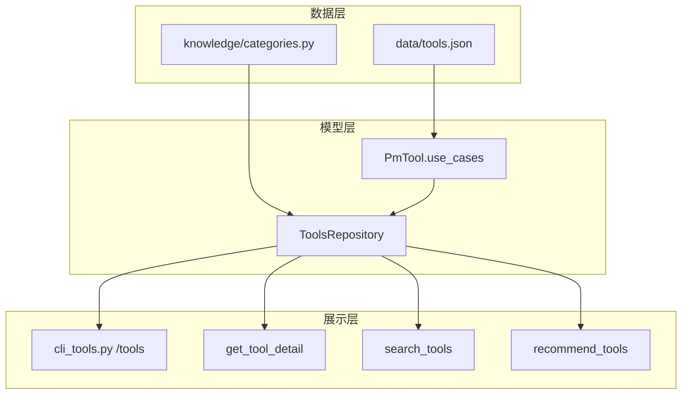
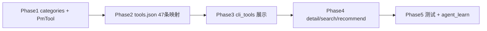

# 工具库场景分类改造（移除 PMBOK 分类字段）

## 目标与原则

- **唯一分类维度**：`use_cases` — 用户语言的场景标签，支持多选（1～3 个）
- **移除 PMBOK 运行时分类**：`process_group` 与 `knowledge_area` 从 `tools.json`、数据模型、CLI、Agent 工具输出、测试中彻底删除
- **PMBOK 溯源**：仅在 `doc/` 文档中保留五过程组/知识领域说明，不进产品数据
- **不改推荐核心逻辑的行为**：`recommend_by_question()` 的 keyword_boosts 继续生效，仅补充场景元数据与一致性校验
- **范围控制**：本迭代只做分类体系与展示对齐，不新增 draftable 工具、不删工具条目

## 为何可以去掉 process_group 与 knowledge_area

| 维度 | 分析 |
|------|------|
| 用户价值 | 个人 PM 找工具靠「我卡在哪」，不靠 PMBOK 教科书分类 |
| 数据质量 | 决策记录标「执行」、决策矩阵标「规划」；`knowledge_area` 对推荐/浏览几乎无贡献 |
| 维护成本 | 每条工具维护 3 套标签（process_group + knowledge_area + use_cases）收益极低 |
| 模型极简 | 工具元数据收敛为：`slug / name / summary / description / steps / scenarios / use_cases / draftable` |
| 代码简化 | 删除 `PROCESS_GROUP_ORDER`、详情与搜索中的 `[规划/风险]` 拼接、推荐 reason 中的 PMBOK 字段引用 |



---

## 1. 场景分类体系（Canonical Taxonomy）

在新建 [`src/pm_agent/knowledge/categories.py`](src/pm_agent/knowledge/categories.py) 中定义常量，作为全项目唯一真相源：

| ID | 显示名 | 典型用户说法 |
|----|--------|-------------|
| `charter` | 立项与授权 | 下周要立项、没正式授权 |
| `scope` | 范围与需求 | 需求太多、边界不清 |
| `schedule` | 进度与排期 | 怎么排期、又延期了 |
| `cost` | 成本与预算 | 超支、预算怎么批 |
| `risk` | 风险与问题 | 担心踩坑、问题没人跟 |
| `stakeholder` | 干系人与协作 | 谁负责、推不动 |
| `communication` | 沟通与汇报 | 周报怎么写、要对老板汇报 |
| `decision` | 决策与分析 | 纠结、选方案、权衡 |
| `change` | 变更与管控 | 需求又改了 |
| `closure` | 收尾与复盘 | 结项、经验教训 |
| `reference` | 流程规范（参考） | 怎么写管理计划（低频参考） |

- `USE_CASE_ORDER: tuple[str, ...]` — 11 个显示名的固定排序（`reference` 放最后，默认折叠感）
- `USE_CASE_IDS` / `display_name()` — slug 与中文名互转（便于测试与校验）
- `validate_use_cases(cases: list[str]) -> None` — 启动时校验非法值

---

## 2. 数据模型变更

### [`src/pm_agent/knowledge/repo.py`](src/pm_agent/knowledge/repo.py)

`PmTool` 变更：

```python
# 新增
use_cases: list[str] = Field(default_factory=list, min_length=1)

# 删除（不再存在于模型与 JSON）
# process_group: str = ""
# knowledge_area: str = ""
```

同步调整：

- **删除** `process_group`、`knowledge_area` 字段及 `search()` haystack 中的引用
- `search()` — 将 `use_cases` 加入检索 haystack
- `_summary_dict()` — 仅输出 `slug / name / summary / use_cases / draftable`（移除 PMBOK 字段）
- 新增 `list_by_use_case(use_case: str) -> list[PmTool]` — 供 CLI 分组
- `from_json_path()` 加载后校验：每条工具至少 1 个合法 `use_cases`；`reference` 可与其它场景共存

### [`data/tools.json`](data/tools.json)

- 为全部 47 条工具补充 `use_cases`
- **删除全部 `process_group` 与 `knowledge_area` 字段**（各 47 处）

核心映射（完整表在实施时逐条写入）：

**决策与分析（8）**
- `decision-matrix`, `swot-analysis`, `pre-mortem`, `moscow-prioritization`, `five-whys`, `force-field-analysis`, `six-thinking-hats`, `decision-record`

**立项与授权（4）**
- `project-charter`, `stakeholder-register`, `assumption-log`, `benefits-management-plan`

**范围与需求**
- 主场景：`requirements-documentation`, `requirements-traceability-matrix`, `project-scope-statement`, `wbs`, `deliverables`, `acceptance-document`
- 双标签：`moscow-prioritization` → `["决策与分析", "范围与需求"]`

**进度与排期**
- `activity-list`, `network-diagram`, `gantt-chart`
- 双标签：`earned-value-analysis`, `variance-analysis` → 含 `成本与预算`

**成本与预算**
- `cost-baseline`, `earned-value-analysis`

**风险与问题**
- `risk-register`, `issue-log`, `risk-report`
- 双标签：`pre-mortem`, `five-whys`, `assumption-log`

**干系人与协作**
- `stakeholder-register`, `raci-matrix`, `team-charter`
- 双标签：`force-field-analysis`, `six-thinking-hats`, `stakeholder-engagement-plan`

**沟通与汇报**
- `status-report`, `final-report`
- 双标签：`risk-report`

**变更与管控**
- `change-request`, `change-management-plan`

**收尾与复盘**
- `lessons-learned-register`, `project-closure-document`, `acceptance-document`, `transition-plan`, `final-report`

**流程规范（参考）** — 所有 `*-management-plan` 及 `project-management-plan`、`benefits-management-plan`、`procurement-management-plan` 均加此标签；其中与业务强相关的可双标（如 `risk-management-plan` → `["流程规范（参考）", "风险与问题"]`）

---

## 3. CLI `/tools` 展示改造

### [`src/pm_agent/cli_tools.py`](src/pm_agent/cli_tools.py)

| 行为 | 改造前 | 改造后 |
|------|--------|--------|
| `/tools` 无参 | 按 `process_group` 五组 | 按 `use_cases` 分组；组内按 slug 排序 |
| 组标题 | `## 规划（28）` | `## 决策与分析（8）` |
| 工具行 | `slug name · draftable` | `slug name · draftable`（不再附过程组小字） |
| `reference` 组 | — | 保留展示，标题注明「参考」 |
| `/tools <slug>` 详情 | 显示 process_group + knowledge_area | 仅显示 `use_cases`（及原有 summary/steps/scenarios 等） |
| `/tools <关键词>` 搜索 | `[规划/风险]` | `[决策与分析]`（多场景时取首个或逗号连接） |

**删除** `PROCESS_GROUP_ORDER` 常量，不再有任何 PMBOK 分类展示入口。

---

## 4. Agent 工具输出对齐

| 文件 | 变更 |
|------|------|
| [`detail.py`](src/pm_agent/tools/knowledge/detail.py) | payload 增加 `use_cases`；移除 `process_group`、`knowledge_area` |
| [`search.py`](src/pm_agent/tools/knowledge/search.py) | 描述改为「场景/用途」；结果仅含 `use_cases`，无 PMBOK 字段 |
| [`recommend.py`](src/pm_agent/tools/knowledge/recommend.py) | 输出仅含 `use_cases`；移除 PMBOK 字段；reason 改为场景表述（如「属于决策与分析场景」） |

**不改动** [`prompts.py`](src/pm_agent/agent/prompts.py) 决策流程段落（已与场景一致）；仅在需要时补一句「推荐结果以 use_cases 场景为主」。

---

## 5. 推荐逻辑轻量对齐（非重构）

[`repo.py`](src/pm_agent/knowledge/repo.py) 的 `keyword_boosts` **保持现有 slug 优先级列表**，避免行为回归。

新增测试 [`tests/test_repo.py`](tests/test_repo.py)：

- `test_all_tools_have_valid_use_cases` — 加载真实 tools.json，校验 47 条
- `test_keyword_boosts_align_with_use_cases` — 每条 keyword_boost 的首位 slug，其 `use_cases` 应与该 boost 语义场景有交集（防止目录与推荐再次脱节）

可选增强（时间允许再做）：在 `search("决策")` 时，匹配 `use_cases` 含「决策与分析」的工具加权 +2。

---

## 6. 测试计划

| 文件 | 新增/修改 |
|------|----------|
| [`tests/test_cli_tools.py`](tests/test_cli_tools.py) | sample repo 加 `use_cases`；`test_format_catalog` 断言 `## 立项与授权` 而非 `## 启动`；详情含 `use_cases:` |
| [`tests/test_repo.py`](tests/test_repo.py) | 全量 use_cases 校验；keyword_boosts 对齐测试；`search` 能命中 use_case 词 |
| 新增 `tests/test_categories.py` | 校验常量完整性、非法 use_case 拒绝 |

运行：`uv run pytest` + `uv run ruff check`

---

## 7. 文档

[`doc/agent_learn.md`](doc/agent_learn.md) 记录：

- **新增功能**：工具库改用 `use_cases` 作为唯一分类；移除 `process_group` 与 `knowledge_area`
- **原因**：PMBOK 分类不适合个人 PM 找工具，维护成本高且与实用场景脱节
- **方案**：`use_cases` 多值字段 + `/tools` 场景目录；PMBOK 概念仅保留在文档

更新 [`doc/PM-Agent-技术方案.md`](doc/PM-Agent-技术方案.md) 工具 JSON schema：`use_cases` 新增；`process_group`、`knowledge_area` 删除。

---

## 8. 实施顺序与预估



| Phase | 内容 | 关键文件 |
|-------|------|----------|
| 1 | 分类常量 + 模型字段 + 校验 | `categories.py`, `repo.py` |
| 2 | 47 条 use_cases 映射；删除 PMBOK 字段 | `data/tools.json` |
| 3 | `/tools` 场景目录；删除全部 PMBOK 分类代码 | `cli_tools.py` |
| 4 | Agent 工具 JSON 输出 | `detail.py`, `search.py`, `recommend.py` |
| 5 | 测试 + 文档 | `tests/*`, `agent_learn.md` |

预估改动：~6 个源码文件 + 1 个新文件 + tools.json + 3 个测试文件，无破坏性 API 变更。

---

## 9. 预期输出效果（示意）

**`/tools` 目录：**

```
知识库工具共 47 个（按实用场景）：

## 决策与分析（8）
  decision-matrix  决策矩阵 · draftable
  decision-record  决策记录 · draftable
  ...

## 立项与授权（3）
  project-charter  项目章程 · draftable
  ...

## 流程规范（参考）（11）
  scope-management-plan  范围管理计划
  ...

提示：/tools <slug> 看详情；/tools <关键词> 搜索。
```

**`/tools decision-matrix` 详情：**

```
slug: decision-matrix
name: 决策矩阵
use_cases: 决策与分析
draftable: true
summary: ...
```

**`/tools 决策` 搜索：**

```
  decision-matrix  决策矩阵  [决策与分析] · draftable
```

---

## 10. 明确不做（本迭代）

- 不删除/合并现有工具
- 不新增 `tier` 字段（可用 `reference` 场景标签达到类似折叠效果）
- 不重构 `keyword_boosts` 为纯 use_case 驱动（降低回归风险）
- 不修改 FakeLLM 演示脚本
