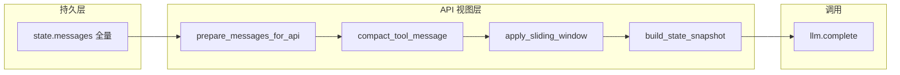

# 对话历史管理：前三层实现计划

## 目标

在每次 `llm.complete` 前，将 `[state.messages](src/pm_agent/agent/session.py)` 转换为**只读 API 视图**，实现：

1. **第一层**：已完成回合内的 `tool` 消息按工具类型压缩
2. **第二层**：滑动窗口保留最近 **15** 个用户回合（含当前回合）
3. **第三层**：窗口裁掉旧回合时，注入 `consulting_notes` + draft 预览 + `mode` 快照

**不变量**：`SessionState.messages` 仍 append-only；debug dump 仍记录全量历史。




---

## 新增模块：`[src/pm_agent/agent/context.py](src/pm_agent/agent/context.py)`

### 配置数据类

```python
@dataclass(frozen=True)
class ContextPolicy:
    enabled: bool = True          # PMBOX_CONTEXT_COMPACT，默认开
    window_turns: int = 15      # PMBOX_CONTEXT_WINDOW
```

从 `[config.py](src/pm_agent/config.py)` 的 `Settings` 解析；`loop` / 测试可显式传入 `ContextPolicy` 覆盖。

### 回合切分

以 `role == "user"` 为边界，将 `messages` 切成 `Turn` 列表：

- **前缀**：首个 `system`（`[_ensure_system_prompt](src/pm_agent/agent/loop.py)` 写入的主提示）始终保留
- **回合内**：`user` 及其后直到下一个 `user` 的所有消息（含中途插入的澄清 `system`、assistant、tool）
- **当前回合**：最后一个 `Turn`；窗口内其余为「已完成回合」

### 第一层：`compact_tool_message(name, content) -> str`

对**已完成回合**内的 `tool` 消息做 JSON 裁剪（解析失败则原样返回）：


| 工具                                                                                                  | 保留字段                                                           |
| --------------------------------------------------------------------------------------------------- | -------------------------------------------------------------- |
| `recommend_tools`                                                                                   | `match_strength`, `tools[].slug/name/reason`, `instruction` 首句 |
| `get_tool_detail`                                                                                   | `slug`, `name`, `summary`, `draftable`                         |
| `start_consulting`                                                                                  | `ok`, `slug`, `name`, `mode`                                   |
| `search_tools`                                                                                      | `query`, `results[].slug/name`（去掉长 description）                |
| `draft_project_charter` / `draft_risk_register` / `draft_decision_record` / `draft_decision_matrix` | `preview`, `missing_fields`, `note`                            |
| `export_markdown`                                                                                   | `ok`, `path`, `doc_type`                                       |
| `note_consulting_fact`                                                                              | 原样（已很短）                                                        |
| `echo` / `add`                                                                                      | 原样                                                             |


压缩后在 JSON 根加 `"_compacted": true`，便于测试断言。

**当前回合**内所有 `tool` 消息保持完整（Agent Loop 同回合多轮迭代依赖它们）。

### 第二层：`apply_sliding_window(turns, window_turns=15)`

- 若 `len(turns) <= window_turns`：全部保留（仍对已完成回合做 tool 压缩）
- 若超出：丢弃最旧 `len(turns) - window_turns` 个回合；返回 `dropped_count > 0`

### 第三层：`build_state_snapshot(state) -> str | None`

当 `dropped_count > 0` 时，在主 `system` 后插入一条：

```text
【会话状态快照】（较早对话已省略，请以此为准）
- 模式：{mode}
- 陪跑工具：{consulting_tool_slug 或「无」}
- 已沉淀事实：
  1. ...
- 章程草稿：{preview_lines 或「无」}
- 风险草稿：...
- 决策记录：...
- 决策矩阵：...
```

仅输出非空段落；若快照与主 system 重复度低且确有 `consulting_notes` 或任一 draft，才注入（避免空块浪费 token）。

消息结构：

```
[system 主提示]
[system 快照]          ← 仅 dropped_count > 0 且有内容
[窗口内历史（旧回合 tool 已压缩）]
[当前回合（完整）]
```

### 入口函数

```python
def prepare_messages_for_api(
    state: SessionState,
    *,
    policy: ContextPolicy | None = None,
) -> list[dict[str, Any]]:
    ...
```

- `policy.enabled is False` → 浅拷贝 `state.messages` 返回
- 纯函数、不修改 `state`

---

## 集成改动

### `[src/pm_agent/agent/loop.py](src/pm_agent/agent/loop.py)`

`run_agent_loop` 内唯一调用点替换：

```python
# 原：llm.complete(state.messages, tools=tools_schema)
api_messages = prepare_messages_for_api(state, policy=context_policy)
response = llm.complete(api_messages, tools=tools_schema)
```

- `run_agent_loop` / `handle_user_turn` 增加可选参数 `context_policy: ContextPolicy | None = None`；默认从 `Settings` 构造
- `_maybe_log_llm_round`：传入 `api_messages` 用于 `~chars` 统计；`TurnDebugDump` 的 `messages` 快照仍用**全量** `state.messages`（保持审计语义）

### `[src/pm_agent/config.py](src/pm_agent/config.py)`

`Settings` 新增：


| 字段                     | 环境变量                    | 默认                       |
| ---------------------- | ----------------------- | ------------------------ |
| `context_compact`      | `PMBOX_CONTEXT_COMPACT` | `true`（仅显式 `0/false` 关闭） |
| `context_window_turns` | `PMBOX_CONTEXT_WINDOW`  | `15`                     |


解析失败时回退默认值；`window_turns` 下限 `>= 1`。

### `[.env.example](.env.example)` + `[README.md](README.md)`

补充两个环境变量说明（一行注释即可）。

---

## 测试：`[tests/test_context.py](tests/test_context.py)`

纯函数单测，不依赖 LLM：


| 用例                         | 断言                                        |
| -------------------------- | ----------------------------------------- |
| `policy.enabled=False`     | 输出与输入消息条数、内容一致                            |
| 旧回合 `get_tool_detail`      | `steps`/`scenarios` 被移除，`_compacted=true` |
| 当前回合 `get_tool_detail`     | 字段完整保留                                    |
| 20 个用户回合 + window=15       | API 视图仅含 15 个 user 起始回合                   |
| 裁掉旧回合且有 `consulting_notes` | 出现 `【会话状态快照】` 且含 fact 文本                  |
| 无裁切                        | 不注入快照块                                    |
| `draft_*` 压缩               | 保留 `preview`，去掉冗长 `consulting_notes` 数组   |
| 非法 JSON tool content       | 原样透传                                      |


可选：在 `[tests/test_loop_limits.py](tests/test_loop_limits.py)` 加一条 FakeLLM 冒烟——`context_compact=True` 时 loop 行为与现有一致（FakeLLM 不校验 messages 内容）。

---

## 文档

`[docs/agent_learn.md](docs/agent_learn.md)` 新增「新增功能」条目：

- 功能：API 前上下文裁剪（tool 压缩 + 15 轮窗口 + 状态快照）
- 原因：对话历史与 tool 返回线性膨胀
- 方案：`context.py` 生成视图，`state.messages` 保持全量

---

## 明确不做（第四、五层）

详见 [docs/后续迭代注意点.md](docs/后续迭代注意点.md) §「对话上下文管理 · 第四、五层」：

- **第四层**：LLM 会话摘要（`session_summary`、超阈值触发、单独 API 调用）
- **第五层**：Token 预算闸门（`PMBOX_CONTEXT_BUDGET`、循环裁剪、附件联动）
- 持久化压缩历史到磁盘（仍保持关进程即丢）

---

## 实现顺序

1. `ContextPolicy` + 回合切分 + tool 压缩（第一层）
2. 滑动窗口（第二层）
3. 状态快照注入（第三层）
4. `loop.py` / `config.py` 接线
5. `test_context.py` + `agent_learn.md` + `.env.example`

