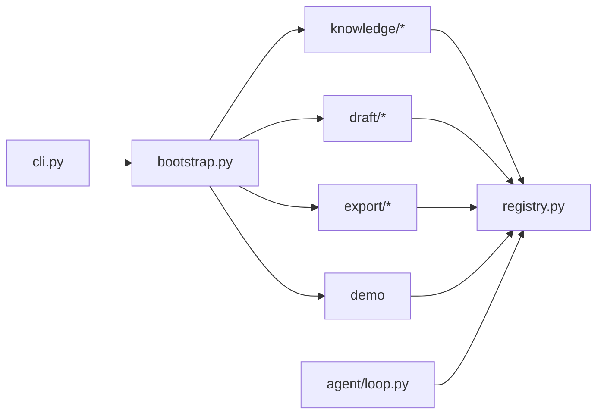

# 工具目录按域重组

## 目标结构

```
src/pm_agent/tools/
├── __init__.py          # 对外导出不变（ToolRegistry / build_registry / demo 辅助）
├── registry.py          # 不动：ToolSpec + ToolRegistry
├── bootstrap.py         # 仅改 import 路径
├── knowledge/
│   ├── __init__.py
│   ├── search.py
│   ├── recommend.py
│   └── detail.py
├── draft/
│   ├── __init__.py
│   ├── charter.py       # 原 draft_charter.py
│   └── risk.py          # 原 draft_risk.py
├── export/
│   ├── __init__.py
│   └── markdown.py      # 原 export_md.py
└── demo/
    └── __init__.py      # 原 demo.py（echo/add + build_demo_registry）
```



## 约定（已拍板）

- **按域分包，不拆「接口 / 实现」**：每个工具文件仍保持 `Args` + `execute` + `register_*` 同居。
- **行为不变**：`include_demo_tools` 默认仍为 `True`；工具名、schema、`pure`/`category` 不改。
- **无兼容 shim**：删除旧扁平路径文件，直接改所有 import（调用方仅内部测试 + CLI）。

## 实现步骤

### 1. 搬迁与改名

用 `git mv` 保留历史，再按需改文件名：

| 原路径 | 新路径 |
|--------|--------|
| `tools/search.py` | `tools/knowledge/search.py` |
| `tools/recommend.py` | `tools/knowledge/recommend.py` |
| `tools/detail.py` | `tools/knowledge/detail.py` |
| `tools/draft_charter.py` | `tools/draft/charter.py` |
| `tools/draft_risk.py` | `tools/draft/risk.py` |
| `tools/export_md.py` | `tools/export/markdown.py` |
| `tools/demo.py` | `tools/demo/__init__.py` |

各子包补 `__init__.py`：可空，或 re-export 该域的 `register_*`（便于阅读即可）。

### 2. 更新组装与公开 API

- [`bootstrap.py`](src/pm_agent/tools/bootstrap.py)：改为从子包导入，例如：
  - `pm_agent.tools.knowledge.search`
  - `pm_agent.tools.draft.charter` / `.risk`
  - `pm_agent.tools.export.markdown`
  - `pm_agent.tools.demo`
- [`tools/__init__.py`](src/pm_agent/tools/__init__.py)：同步 demo 导入路径；`__all__` 保持不变。

### 3. 更新测试 import

需改路径的测试：

- [`tests/test_tool_parallel.py`](tests/test_tool_parallel.py)：`demo`、`draft.charter`
- [`tests/test_loop_limits.py`](tests/test_loop_limits.py)、[`tests/test_trace.py`](tests/test_trace.py)、[`tests/test_llm_real.py`](tests/test_llm_real.py)：`tools.demo`

其余走 `bootstrap` / `registry` 的测试可不动。

### 4. 同步文档

- [`CLAUDE.md`](CLAUDE.md) / [`AGENTS.md`](AGENTS.md)：目录树改为上述子包结构。
- [`doc/PM-Agent-技术方案.md`](doc/PM-Agent-技术方案.md) §6.2：`tools/` 树与「`tools/pm_*.py`」表述改为域分包。
- [`doc/agent_learn.md`](doc/agent_learn.md)：记一条「新增功能」——按域重组 tools 目录；原因：扁平难扫；方案：knowledge/draft/export/demo + 根级 registry/bootstrap。

### 5. 验证

```bash
uv run pytest
uv run ruff check src/pm_agent/tools tests
```

确认注册工具名集合与重组前一致（可通过现有 acceptance / repo 测试间接覆盖）。

## 明确不做

- 不抽统一 `contracts/` / Args 集中目录
- 不改 Agent Loop、LLM、工具执行语义
- 不默认关闭 demo 注册（避免顺带改运行时行为）
