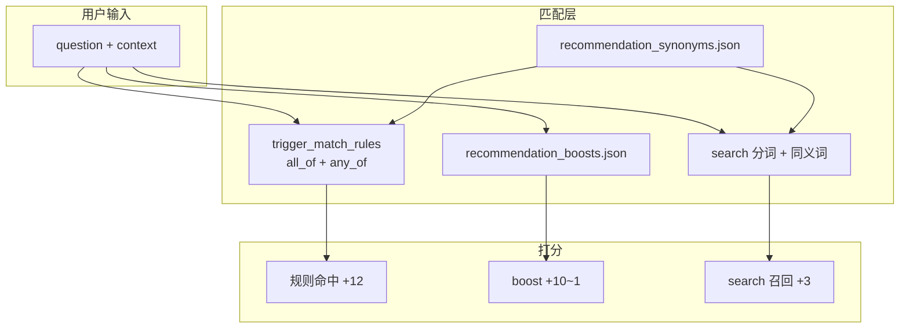
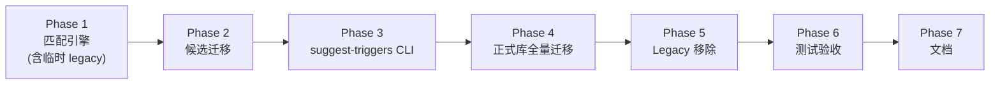

# 推荐匹配规则改造计划

## 背景与目标

当前 `[recommend_by_question](src/pm_agent/knowledge/repo.py)` 对 `trigger_phrases` 使用 `phrase in text` 精确子串匹配（+12 分），导致：

- 评测问句与候选短语措辞不一致时（如「老板」vs「客户」、「改了A接口会不会影响B系统」vs「改了A会不会影响B」）无法拿高分
- 批量补词的脚本因「短语必须是问句子串」假设而自相矛盾报错
- 范围与变更管控家族 5 个候选工具反复卡在 `candidate-top3`（正例 Top3 ≥80%）

**目标**：零 API 成本、零新重依赖，让匹配机制具备口语改写泛化能力；候选工具通过 A/B 门禁；**正式库全量迁移后移除 legacy 双轨，长期只保留 `trigger_match_rules` 一套打分机制**。




## 核心设计决策

### 1. 字段职责拆分（不破坏现有内容门禁）


| 字段                                            | 职责                                       | 变更          |
| --------------------------------------------- | ---------------------------------------- | ----------- |
| `trigger_phrases: list[str]`                  | 用户原话示例；参与 `search()` 索引；eval-prompt 语料约束 | **保留**，语义不变 |
| `trigger_match_rules: list[TriggerMatchRule]` | **仅用于 +12 分打分**                          | **新增**      |


`TriggerMatchRule` 结构（Pydantic 校验）：

```python
class TriggerMatchRule(BaseModel):
    all_of: list[str] = Field(default_factory=list)  # 全部须命中
    any_of: list[str] = Field(default_factory=list)  # 至少命中一个
    # 约束：all_of 与 any_of 不能同时为空
```

命中判定（中文友好，仍用子串，但粒度降到关键词）：

- 对每个 keyword，先在 `[data/recommendation_synonyms.json](data/recommendation_synonyms.json)` 中展开同义词集合
- `all_of` 中每个词（或其同义词）都必须是 `text` 的子串
- 若 `any_of` 非空，其中至少一个词（或其同义词）必须是 `text` 的子串
- 工具命中条件：**任意一条** `trigger_match_rules` 满足即可 +12

**迁移期兼容（临时）**：若 `trigger_match_rules` 为空，回退到现有 `trigger_phrases` 精确子串逻辑。此回退**仅用于迁移窗口**，全量迁移完成后在 Phase 5 删除。

**长期目标（单轨）**：

- `trigger_phrases`：只保留「用户原话示例 + search 索引 + eval-prompt 语料」，**不再参与 +12 打分**
- `trigger_match_rules`：所有工具（正式库 + 候选）**必填**，至少 1 条
- 删除 `recommend_by_question` 中的 `phrase in text` legacy 分支

### 2. 同义词表（零运行时成本）

新增 `[data/recommendation_synonyms.json](data/recommendation_synonyms.json)`：

```json
{
  "客户": ["老板", "甲方", "领导", "赞助人"],
  "变更": ["改动", "修改", "调整"],
  "蔓延": ["加需求", "塞需求", "口头改", "增量需求"],
  "影响": ["波及", "连带", "冲击"]
}
```

- 在 `ToolsRepository.__init__` 或模块级加载一次
- 同时用于 `trigger_match_rules` 判定和 `search()` 分词命中
- 初始版本控制在 20～40 组高频 PM 口语同义词，后续按需扩展

### 3. 增强 `search()` 弱召回

`[search()](src/pm_agent/knowledge/repo.py)` 当前对中文长句分词能力弱（仅空格切分）。改造：

- 提取公共 `_keyword_variants(keyword, synonyms) -> set[str]`
- 分词 token 命中 haystack 时，同步检查同义词变体
- 将 `trigger_match_rules` 中的关键词也拼入 haystack（提升 +3 分召回）

### 4. 不改动的部分

- 评测 runner / gates 逻辑不变（仍调用 `recommend_by_question`）
- `recommendation_boosts.json` 打分逻辑暂不动（避免引入新的误召回；若迁移后仍有边界问题再单独收窄）
- **不引入** embedding、jieba、新 Python 重依赖

---

## 实现步骤

### Phase 1：匹配引擎（核心代码）

**新增** `[src/pm_agent/knowledge/matching.py](src/pm_agent/knowledge/matching.py)`（纯函数，便于单测）：

- `load_synonyms(path) -> dict[str, list[str]]`
- `expand_keyword(keyword, synonyms) -> set[str]`
- `match_trigger_rule(text, rule, synonyms) -> bool`
- `tokenize_query(text) -> list[str]`（保留空格切分 + 对无空格中文 query 做简单 2～4 字滑动窗口备选 token，仅用于 search，不用于 trigger 规则）

**修改** `[src/pm_agent/knowledge/repo.py](src/pm_agent/knowledge/repo.py)`：

- `PmTool` 增加 `trigger_match_rules: list[TriggerMatchRule]`
- `ToolsRepository.from_json_path` 加载同义词表（文件缺失时用空 dict，不阻断启动）
- `recommend_by_question`：优先走 rules 匹配；rules 为空时走 legacy `trigger_phrases`
- `search()`：接入同义词扩展

**修改** `[src/pm_agent/knowledge/catalog_ops.py](src/pm_agent/knowledge/catalog_ops.py)`：

- `ToolCandidate` / promote 流程透传 `trigger_match_rules`
- `strict_tool_issues` 增加：`trigger_match_rules` 至少 1 条（候选/新工具）；正式库旧条目可暂缺（靠 legacy 回退）
- 更新 `build_generation_prompt` / `build_eval_prompt` 文案：说明 `trigger_phrases`（原话）与 `trigger_match_rules`（匹配规则）的分工

### Phase 2：候选池迁移（先打通门禁）

**候选池** [`data/tool_candidates.json`](data/tool_candidates.json) — 重点迁移卡门禁的 5 个「范围与变更管控」工具：

以 `scope-creep-negotiation` 为例，将现有 22 条长短不一的 `trigger_phrases` **精简保留 5 条原话**，新增规则：

```json
"trigger_match_rules": [
  {"all_of": ["需求"], "any_of": ["拒绝", "加", "塞", "蔓延", "延期"]},
  {"all_of": ["口头"], "any_of": ["变更", "承诺", "先做"]},
  {"all_of": ["客户"], "any_of": ["不高兴", "加功能", "新需求"]},
  {"any_of": ["评审会", "需求收集", "范围打开"]},
  {"any_of": ["顺手做", "很小", "三个模块"]}
]
```

`change-impact-triage` 类似：

```json
"trigger_match_rules": [
  {"all_of": ["改"], "any_of": ["影响", "代价", "多少人天", "延期"]},
  {"all_of": ["变更"], "any_of": ["影响", "评估", "说不出数据"]},
  {"any_of": ["接口", "组件", "依赖", "返工成本"]}
]
```

对其余 3 个候选（`requirements-clarification-canvas`、`deliverable-definition-of-done`、`scope-conflict-resolution`）按同样模式从失败用例反推规则（见 Phase 3）。

每迁移一个候选 → `evaluate-candidate <slug>` 直到 Top3 ≥80%。

### Phase 3：失败用例反推 CLI

**新增** [`src/pm_agent/evaluation/trigger_diagnostics.py`](src/pm_agent/evaluation/trigger_diagnostics.py)：

- 输入：slug + 评测报告（支持 `--formal` 对正式库工具）
- 输出：该 slug 正例中 Top3 未命中的 query 列表 + 每条 query 的当前 Top3 + **建议补充的 any_of 关键词**（从 query 中提取 2～4 字 n-gram，排除停用词，与已有 rules 做差集）

**扩展** [`scripts/manage_tool_catalog.py`](scripts/manage_tool_catalog.py)：

```bash
uv run python scripts/manage_tool_catalog.py suggest-triggers <slug>           # 候选
uv run python scripts/manage_tool_catalog.py suggest-triggers --formal <slug>  # 正式库
uv run python scripts/manage_tool_catalog.py migration-status                  # 列出尚未迁移的 slug
```

工作流（替代「先编短语再断言子串」）：

1. `evaluate-candidate <slug>` 或 `evaluate` → 看失败项
2. `suggest-triggers <slug>` → 获取关键词建议
3. 人工确认后写入 `trigger_match_rules`
4. 重跑评测直到通过

### Phase 4：正式库全量迁移（按家族分批）

**目标**：[`data/tools.json`](data/tools.json) 全部 ~29 个正式工具补齐 `trigger_match_rules`，**不再依赖 legacy 子串 +12**。

**迁移顺序**（每批迁移后跑 `evaluate`，指标不退化再进下一批）：

| 批次 | 家族 | 工具数（约） | 依据 |
|------|------|-------------|------|
| 1 | 沟通与冲突 | 6 | 已有大量黄金用例 + 混淆对回归 |
| 2 | 复盘与学习 | 4 | test_repo 有 Top1 回归 |
| 3 | 向上管理与汇报 | 5 | test_repo 有 Top3 回归 |
| 4 | 启动与章程 / 决策 / 风险 / 其余 | ~14 | evaluate 报告 + suggest-triggers |

**每个工具的迁移动作**：

1. 保留 3～5 条高质量 `trigger_phrases`（用户原话，给人看）
2. 从现有 `trigger_phrases` + 对应黄金用例 + `suggest-triggers` 输出，提炼 3～6 条 `trigger_match_rules`
3. 跑该家族相关用例 + 全量 `evaluate` 确认 Top1/Top3/MRR/误召回无退化
4. 人工确认后进入下一批

### Phase 5：Legacy 移除（收口单轨）

**前置条件**：`migration-status` 显示正式库 + 候选池 100% 工具均有 `trigger_match_rules`。

**代码改动** [`src/pm_agent/knowledge/repo.py`](src/pm_agent/knowledge/repo.py)：

- 删除 `recommend_by_question` 中 `trigger_phrases` 子串 +12 分支
- +12 分**仅**来自 `trigger_match_rules`

**门禁收紧** [`src/pm_agent/knowledge/catalog_ops.py`](src/pm_agent/knowledge/catalog_ops.py)：

- `strict_tool_issues`：`trigger_match_rules` 至少 1 条 → **所有工具**（含正式库 validate）
- 新增校验脚本或 `validate` 子命令扩展：扫描 `tools.json`，任何 slug 缺 rules 则报错

**测试更新**：

- 删除「空 rules 回退 legacy」相关测试
- 新增「缺 rules 的 PmTool 加载/校验失败」测试

### Phase 6：测试与验收

**新增/更新测试** `[tests/test_matching.py](tests/test_matching.py)`（新文件）：

- `all_of` / `any_of` / 同义词展开
- 迁移期：空 rules 回退 legacy（Phase 5 完成后删除此类测试）
- 收口后：缺 rules 校验失败
- 回归用例：scope-013「需求越加越多，又不敢拒绝，怕老板不高兴」应命中 `scope-creep-negotiation`（「老板」via 同义词「客户」）
- 长句改写：「改了A接口会不会影响B系统的功能，得评估一下才能回复」应命中 `change-impact-triage`

**更新** [`tests/test_repo.py`](tests/test_repo.py)：确保全部正式工具推荐回归通过（迁移完成后不再依赖 legacy）

**更新** [`tests/test_catalog_ops.py`](tests/test_catalog_ops.py)：promote 透传 `trigger_match_rules`；validate 缺 rules 报错

**验收命令序列**（分阶段）：

```bash
# Phase 2 完成后：候选门禁
uv run python scripts/manage_tool_catalog.py evaluate-candidate scope-creep-negotiation
# ... 对其余 4 个候选重复 → promote

# Phase 4 每批完成后：正式库无回归
uv run python scripts/manage_tool_catalog.py evaluate

# Phase 5 完成后：全量收口
uv run python scripts/manage_tool_catalog.py migration-status  # 应显示 100%
uv run pytest && uv run ruff check
uv run python scripts/manage_tool_catalog.py evaluate
uv run python scripts/manage_tool_catalog.py update-baseline --yes  # 人工确认指标
```

### Phase 7：文档

- [`docs/agent_learn.md`](docs/agent_learn.md)：记录「推荐匹配升级 + 正式库全量迁移 + legacy 移除」
- [`docs/PM-工具库运营手册.md`](docs/PM-工具库运营手册.md)：§5 补充 `trigger_match_rules` 必填；§6 加入 `suggest-triggers` / `migration-status` 步骤
- [`.claude/skills/pm-tool-catalog/SKILL.md`](.claude/skills/pm-tool-catalog/SKILL.md)：同步工作流；新工具入库必须同时写 `trigger_phrases` + `trigger_match_rules`

---

## 阶段总览



**双轨存在窗口**：Phase 1 引入 legacy 回退 → Phase 4 全量迁移 → Phase 5 删除回退。**计划完成时只剩单轨。**

---

## 风险与缓解


| 风险                                        | 缓解                                                                                       |
| ----------------------------------------- | ---------------------------------------------------------------------------------------- |
| 规则过宽导致家族内互抢（scope-creep vs change-impact） | 规则用 `all_of` 拉高精度；边界用例靠现有 `forbidden_top3` 门禁；必要时为 change-impact 加 `all_of: ["评估","影响"]` |
| 正式库回归（迁移期） | legacy 回退 + 每批 `evaluate` 对比 baseline；Phase 5 后靠 rules 单轨 |
| 正式库回归（收口后） | 全量迁移 + legacy 移除后跑 `evaluate` + `update-baseline --yes` |
| 迁移工作量大 | 按家族分批 + `suggest-triggers` / `migration-status` 辅助；每批独立验收 |
| 同义词误展开                                    | 同义词表保守起步；每组 2～4 个近义词；单测覆盖已知反例                                                            |
| 中文分词仍弱                                    | trigger 规则粒度已降到 2～4 字关键词子串；search 层仅作 +3 兜底                                              |


## 不在本次范围

- 语义 embedding / 本地 sentence-transformers
- `anti-triggers` 降权规则（可作为后续迭代）
- 修改 `recommendation_boosts.json` 结构
- 自动写回 `trigger_match_rules`（仅 suggest，人工确认后写入）

