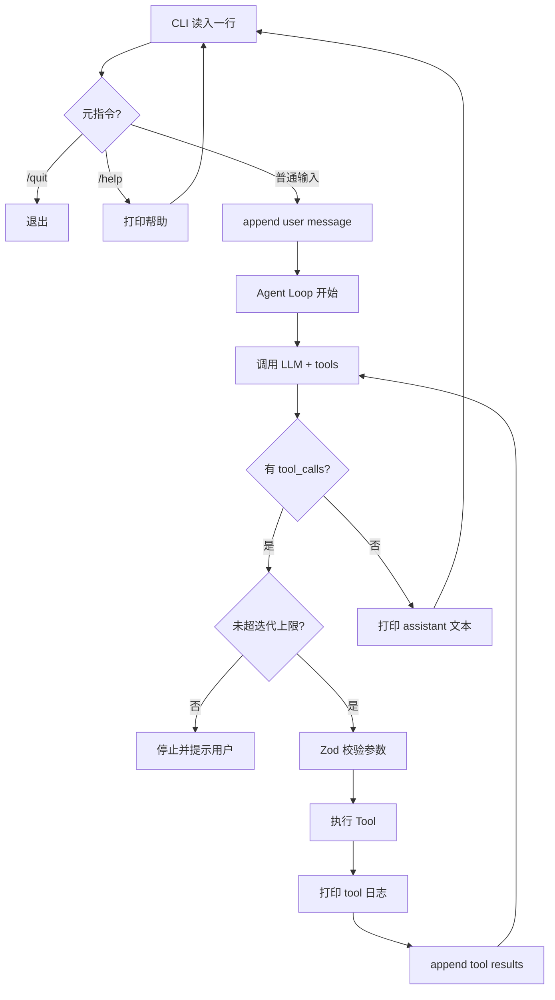
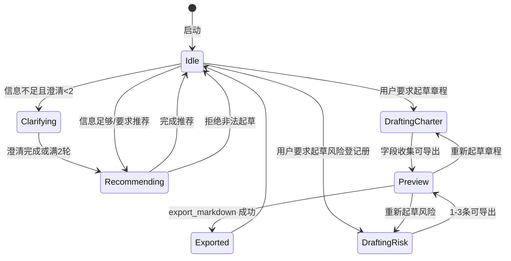

# PM Agent - 技术方案文档

---

## 0. 文档信息

- **项目名称**：PM Agent  
- **文档版本**：最终版 v1.0  
- **创建时间**：2026-07-14  
- **最近更新时间**：2026-07-14  
- **关联文档**：
  - PRD：`项目文档/PM-Agent/PM-Agent-MVP-PRD.md`
  - 技术调研文档：`项目文档/PM-Agent/TDD/PM-Agent-技术选型调研-2026-07-14.md`
  - 需求孵化：`docs/pm-agent/需求孵化.md`

---

## 1. 概述 (Overview)

> 产品背景详见 PRD，本节只写技术目标。

### 1.1 技术目标

- **性能目标**：单轮用户输入到首段可见反馈（含工具日志）可接受；不追求高并发（单机单会话）
- **可扩展性目标**：Tool Registry 可增删工具；LLM Provider 可切换（DeepSeek / OpenAI 兼容）
- **开发效率目标**：自研最小循环 + 少量工具，优先可跑通主路径；练手可对照书复盘
- **成本目标**：默认 DeepSeek；工具分层加载，避免每轮塞满 39 工具全文
- **其他**：循环可见、迭代上限、路径写入白名单、密钥不进导出文件

### 1.2 关键技术选型理由

> 本项目为 **CLI 单体进程**，无浏览器前端、无独立 HTTP 后端、无数据库。下表按模板结构映射到「交互层 / 运行时 / 第三方」。

**交互层（对应模板「前端」）**：
- **框架**：Node.js `readline/promises` — 最小对话循环，无 Ink
- **状态管理**：进程内 `SessionState` 对象 — 无跨端状态库
- **UI 组件库**：无（纯文本）
- **样式方案**：约定日志前缀 `[tool]` / 结构化列表

**运行时（对应模板「后端」）**：
- **语言 & 框架**：TypeScript + 自研 Agent Loop — 练手核心；不上 LangGraph/Mastra/Agents SDK
- **数据库**：无；知识在 `data/tools.json`，产物在 `output/*.md`
- **缓存**：无
- **对象存储**：无

**第三方服务**：
- DeepSeek Chat Completions + Tool Calls（`openai` SDK，`baseURL=https://api.deepseek.com`）— 与 `pm-toolbox` 习惯一致
- 可选 OpenAI 兼容端作为备选 Provider

> 详细对比见：`项目文档/PM-Agent/TDD/PM-Agent-技术选型调研-2026-07-14.md`

---

## 2. 系统架构 (Architecture)

### 2.1 整体拓扑图

单体 Node 进程：CLI 读输入 → Agent Loop 调 LLM → 执行本地 Tool → 更新会话状态 / 写文件 → 打印回复。

```
┌─────────────────────────────────────────────┐
│                 CLI 进程 (pm-agent)           │
│  ┌──────────┐   ┌──────────┐   ┌──────────┐ │
│  │ readline │→  │ Agent    │→  │ Tool     │ │
│  │  I/O     │   │ Loop     │   │ Registry │ │
│  └──────────┘   └────┬─────┘   └────┬─────┘ │
│                      │              │       │
│                 ┌────▼────┐    ┌────▼────┐  │
│                 │ LLM     │    │ tools.  │  │
│                 │ Client  │    │ json +  │  │
│                 │(DeepSeek)│   │ output/ │  │
│                 └─────────┘    └─────────┘  │
└─────────────────────────────────────────────┘
         │ HTTPS（仅模型 API）
         ▼
   DeepSeek / OpenAI 兼容网关
```

**数据流**：
1. 用户文本 → 追加到 `messages`
2. Loop 调用 LLM（带 tools 定义）
3. 若有 `tool_calls`：校验参数 → 执行 → 追加 `role:tool` → 打 `[tool]` 日志 → 继续 Loop
4. 若无 tool_calls：把 assistant 文本打印给用户，等待下一轮输入
5. `export_markdown` 仅写入 `output/`

### 2.2 交互层架构（原「前端架构」）

- **架构模式**：命令行 REPL（Read-Eval-Print Loop）挂接 Agent
- **模块划分**：`cli/`（输入输出）与 `agent/`（推理循环）分离
- **状态管理**：`SessionState`（messages、clarificationCount、draftCharter、draftRisks）
- **路由**：无 URL；元指令 `/help` `/quit` 在 CLI 层预处理
- **构建工具**：`tsx` 直接运行；可选 `tsc` 产出 `dist/`

### 2.3 运行时模块划分（原「后端服务」）

- **服务架构**：单体内核（单进程）
- **模块划分**：
  | 模块 | 职责 |
  |------|------|
  | `cli` | 提示符、打印、元指令 |
  | `agent/loop` | 迭代上限、调度 LLM 与工具 |
  | `agent/llm` | Provider 适配、错误分类 |
  | `tools/*` | 各工具 execute |
  | `data` | 加载 tools.json |
  | `export` | Markdown 渲染与落盘 |
- **服务边界**：工具层做副作用与白名单；Loop 不做业务知识；LLM 不做文件写入
- **服务通信**：进程内函数调用；对 LLM 为 HTTPS

### 2.4 解耦方案

- **「前后端」分离（映射）**：CLI 只负责 I/O；Agent/Tools 不 `console.log` 业务例外（统一经 Logger/打印机）
- **数据访问层解耦**：`ToolsRepository` 只读 JSON；导出经 `MarkdownExporter`；禁止工具直接 `fs.writeFile` 到任意路径
- **业务逻辑解耦**：推荐校验、白名单起草、字段占位规则放在 tools / domain，不塞进 prompt  alone

---

## 3. 详细设计 (Detailed Design)

### 3.1 核心逻辑流程图



### 3.2 状态机图

**会话层状态**（粗粒度，便于实现与测试）：



说明：状态可由 `SessionState.mode` 显式维护，也可由「对话+草稿是否存在」隐式推导；MVP 推荐 **显式 mode**，减少模型乱跳。

### 3.3 关键算法

#### 算法1：Agent Loop 控制

- **适用场景**：每一轮用户输入后的推理执行
- **思路**：`for (i=0; i<maxIterations; i++)` 调模型；有 tool_calls 则执行并 continue；否则 break；连续工具错误达阈值则 break 并注入纠正指令
- **输入**：messages、tools、maxIterations（建议 8～12）
- **输出**：最终 assistant 文本 + 副作用（草稿/文件）
- **复杂度**：O(iterations × (LLM + tools))；工具数固定约 6，可视为常量
- **边界**：空 tool_calls + 空 content → 提示重试；畸形 JSON arguments → 工具层返回错误指令，不抛垮进程

#### 算法2：推荐结果校验

- **适用场景**：`recommend_tools` 返回或模型口述推荐后的规范化
- **思路**：用 slug 集合与 `tools.json` 求交；非法剔除；不足则按知识领域关键词兜底（可参考 toolbox fallback，可选）
- **输入**：候选 slug 列表、question
- **输出**：1～3 个合法工具摘要
- **边界**：0 条 → 返回「引导补充阶段」类错误指令给模型或直接展示给用户

#### 算法3：Markdown 导出命名

- **思路**：`{文档类型}-{YYYYMMDD-HHmm}.md`；若存在则 `-2` `-3` 递增
- **边界**：目录不可写 → 抛业务错误，保留终端预览

### 3.4 异常处理流程

**错误处理策略**：
- **网络错误**（超时/5xx）：LLM Client 短重试 1～2 次；仍失败 → CLI 提示「模型暂不可用…可直接说起草…」
- **业务错误**（非法起草、空库、校验失败）：Tool 返回字符串须含「不要… / 应该… / 示例」，Loop 继续让模型纠正
- **系统错误**（未捕获异常）：记录 stack 到 stderr；对用户一句友好话；会话可继续

**边界情况**：
- **空输入**：CLI 层拦截，不调 LLM
- **超时**：单次 LLM 请求 timeout（如 60s）
- **并发**：单线程会话，无并发写；不实现多会话并行

---

## 4. 数据结构 (Data Schema)

### 4.1 建模原则

- MVP **无 SQL 数据库**
- 权威只读源：`data/tools.json`
- 运行时状态：内存 TypeScript 对象
- 持久产物：`output/*.md`（用户资产）

### 4.2 「表」结构的 TypeScript 等价定义

**实体：Tool（来自 JSON）**

| 字段 | 类型 | 说明 |
|------|------|------|
| slug | string | 主键 |
| name | string | 中文名 |
| nameEn | string | 英文名 |
| processGroup | string | 过程组 |
| knowledgeArea | string | 知识领域 |
| summary | string | 摘要 |
| description | string | 详述 |
| steps | string[] | 步骤 |
| scenarios | string[] | 场景 |
| templateType | form/table/... | 模板类型 |
| templateFields / tableConfig | object | 起草字段来源 |

**实体：SessionState（内存）**

| 字段 | 类型 | 说明 |
|------|------|------|
| mode | enum | idle/clarifying/recommending/drafting_charter/drafting_risk/preview |
| messages | ChatMessage[] | OpenAI 兼容消息 |
| clarificationCount | number | 0～2 |
| draftCharter | Record\<string,string\> \| null | 章程字段 |
| draftRisks | RiskRow[] | 最多引导 3 条 |
| lastExportPath | string \| null | 上次导出路径 |

**实体：RiskRow**

| 字段 | 类型 |
|------|------|
| riskId, description, cause, probability, impact, score, response, owner, status | string |

### 4.3 DDL 示例

不适用关系库。若未来持久化会话，可迁移为：

```sql
-- 仅作未来扩展示意，MVP 不创建
CREATE TABLE sessions (
  id TEXT PRIMARY KEY,
  mode TEXT NOT NULL,
  messages_json TEXT NOT NULL,
  draft_json TEXT,
  created_at TEXT NOT NULL
);
```

### 4.4 缓存设计

- MVP 无 Redis
- 可选：启动时把 tools 摘要列表缓存到内存（一次加载）

### 4.5 数据访问层

- `ToolsRepository.load()` / `findBySlug()` / `search(keyword)`
- `SessionStore`（可先用简单可变对象，便于测）
- `MarkdownExporter.write(docType, payload) → path`
- 不使用 ORM

---

## 5. 接口定义 (API Specs)

### 5.1 接口规范

本 MVP **无对外 HTTP API**。契约分两层：

1. **LLM Tool 契约**（模型可见）：OpenAI function calling schema  
2. **进程内模块契约**（开发者可见）：TypeScript 函数签名  

若未来挂 Web，可把 Loop 包成 `POST /v1/chat`，本阶段不实现。

### 5.2 核心 Tool 契约

统一规范：
- `name`：snake_case  
- `description`：含何时用 / 何时不用  
- 返回：`string`（给模型读的观察结果；失败时写纠正指令）

#### `search_tools`
- **描述**：按关键词检索工具库摘要；不确定用哪个工具时先搜。不要用于起草文档。
- **参数**：`{ query: string }`
- **成功返回**：JSON 字符串列表（slug, name, summary, knowledgeArea）

#### `get_tool_detail`
- **描述**：查看某工具完整步骤与模板字段。不要用本工具写入文件。
- **参数**：`{ slug: string }`
- **失败**：slug 不存在 → 提示从 search 结果选

#### `recommend_tools`
- **描述**：根据用户卡点推荐 1～3 个库内工具；必须返回库内 slug。信息不足应先向用户澄清（非本工具职责时可直接返回需澄清标记）。
- **参数**：`{ question: string, max?: number }`（max 默认 3）
- **返回**：`{ reasoning, tools: [{slug,name,summary,processGroup,knowledgeArea}] }`

#### `draft_project_charter`
- **描述**：仅用于更新「项目章程」会话草稿。不要用于其他文档。字段可分多次调用合并。未知填「待补充」。
- **参数**：部分字段可选的 object（对齐 templateFields）
- **副作用**：更新 `draftCharter`，mode→drafting_charter/preview
- **返回**：当前草稿摘要

#### `draft_risk_register`
- **描述**：仅用于风险登记册；默认累计不超过 3 条。不要起草章程或其他工具。
- **参数**：`{ risks: RiskRow[] }` 或 `add_risk: RiskRow`
- **副作用**：更新 `draftRisks`
- **返回**：当前条目摘要

#### `export_markdown`
- **描述**：将当前章程或风险草稿导出到 output/。仅当草稿存在时使用。禁止自定义绝对路径。
- **参数**：`{ docType: "project_charter" | "risk_register" }`
- **成功返回**：文件绝对路径
- **失败**：无草稿 / 无写权限 → 纠正指令

### 5.3 进程内「API」示意（非 HTTP）

**ChatMessage / LLMClient.complete**
- **入参**：`{ messages, tools, model? }`
- **出参**：`{ content, tool_calls[] }`

**AgentLoop.runTurn**
- **入参**：`userText: string`
- **出参**：`{ assistantText: string }`

### 5.4 业务逻辑

- **鉴权**：依赖本机 `.env` API Key；无用户体系
- **业务规则**：可起草白名单；推荐 slug 校验；导出路径限制 `output/`
- **日志**：`[tool] name args_summary → ok|err message`；禁止打印完整 API Key

---

## 6. 安全与部署 (Ops & Security)

### 6.1 环境变量配置

| 变量 | 必填 | 说明 |
|------|------|------|
| `DEEPSEEK_API_KEY` | 主路径必填其一 | DeepSeek |
| `OPENAI_API_KEY` | 可选 | 兼容备选 |
| `LLM_PROVIDER` | 可选 | `deepseek` \| `openai`，默认 deepseek |
| `LLM_MODEL` | 可选 | 默认与 Provider 匹配 |
| `MAX_AGENT_ITERATIONS` | 可选 | 默认 10 |
| `OUTPUT_DIR` | 可选 | 默认 `./output` |

- `.env` 本地配置；`.env.example` 只含键名
- `.gitignore`：`.env`、`output/`（或仅 ignore 内容保留目录）、`node_modules/`

### 6.2 目录结构

CLI 单体，不做 `client/` + `server/` 双包；逻辑上仍分离 I/O 与 Agent：

```
pm-agent/
├── package.json
├── tsconfig.json
├── .env.example
├── .gitignore
├── README.md
├── data/
│   └── tools.json          # 自 pm-toolbox 复制/同步
├── output/                 # 导出目录（可 gitkeep）
├── src/
│   ├── index.ts            # 入口：启动 REPL
│   ├── cli/
│   │   ├── repl.ts
│   │   └── printer.ts
│   ├── agent/
│   │   ├── loop.ts
│   │   ├── session.ts
│   │   ├── system-prompt.ts
│   │   └── llm/
│   │       ├── client.ts
│   │       └── providers.ts
│   ├── tools/
│   │   ├── registry.ts
│   │   ├── types.ts
│   │   ├── search-tools.ts
│   │   ├── get-tool-detail.ts
│   │   ├── recommend-tools.ts
│   │   ├── draft-charter.ts
│   │   ├── draft-risk-register.ts
│   │   └── export-markdown.ts
│   ├── data/
│   │   └── tools-repo.ts
│   ├── export/
│   │   └── markdown.ts
│   └── util/
│       ├── env.ts
│       └── logger.ts
└── tests/
    ├── loop.test.ts
    ├── recommend.test.ts
    └── export-path.test.ts
```

### 6.3 代码规范

- TypeScript `strict: true`
- 建议 ESLint + Prettier（可阶段 1 后补）
- 工具 description 变更视为产品行为变更，需人工过目
- 安全：`export_markdown` resolve 路径必须 `startsWith(outputRoot)`

---

## 7. 架构深度审校

### ① 前后端分离审查
- CLI 与 Agent 分模块：通过  
- 无 HTTP 契约需求：标注 N/A，Tool 契约已定义：通过  

### ② 解耦与模块化审查
- 业务写入（草稿/文件）在 tools，不在 CLI：通过  
- tools.json 经 Repository，不散落 hardcode：通过  

### ③ 极致裁剪自检
- 无 DB/无 MCP/无 Web：通过  
- 推荐与校验合并进 `recommend_tools`，避免重复逻辑：建议实现时 DRY  
- 数据模型稳定：Tool schema 来自现成 JSON，接口不易因微调连锁爆炸：通过  

---

## 8. 附录

- **参考资料**：
  - DeepSeek Tool Calls 官方文档
  - Anthropic Tool-using agent loop 教程（消息追加模式）
  - 《从零到一造 Agent》循环/工具/错误处理要点
  - `pm-toolbox` `data/tools.json` 与 recommend API
