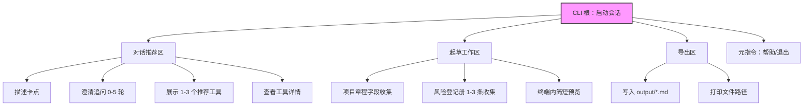
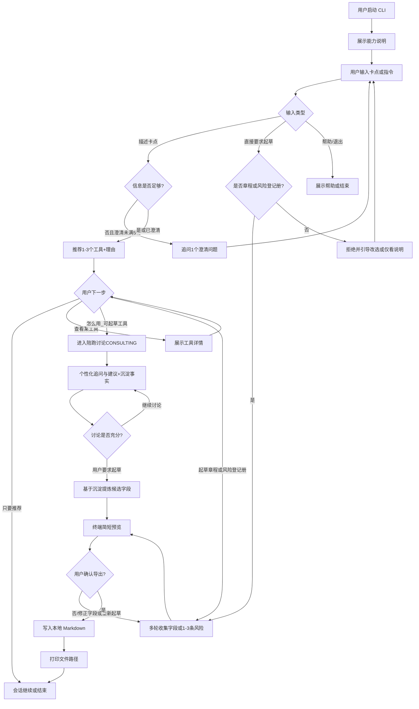

# PM Agent - MVP PRD

**项目名称**：PM Agent  
**目标平台**：命令行（CLI）终端  
**文档版本**：最终版 v1.0  
**创建时间**：2026-07-14  
**文档状态**：已审校

---

## 1. 典型用户画像

**一句话描述**：一位需要同时推进多个项目的个人项目经理（第一用户为自己），在立项授权或风险冒出时，既想快速知道该用哪套 PM 工具，又不想面对空白模板无从下笔，希望在终端里用几轮对话就带走一份可改的 Markdown 草稿；同时希望亲手造 Agent，验证「推荐 + 开干」闭环是否成立。

---

## 2. 场景故事

**一句话描述**：用户在电脑前启动 CLI，输入「下周要立项，还没正式授权」，Agent 追问一句项目目的后推荐「项目章程」等工具；用户说「帮我起草」，Agent 按字段补齐关键信息并导出 `项目章程-xxx.md`，用户打开文件改完即可发给发起人。

---

## 3. 功能清单

### 3.1 核心功能（明确要做的）

1. **启动与会话**
   - 用户在终端启动 CLI，进入多轮对话会话
   - 启动时展示一句能力说明：可推荐工具；可起草「项目章程 / 风险登记册」并导出 Markdown
   - 支持退出指令 `/quit` 结束会话

2. **卡点澄清（可选，最多 5 轮）**
   - 用户描述工作卡点后，若信息过少导致无法可靠推荐，Agent 最多追问 5 个澄清问题
   - 澄清问题必须具体、可回答（例如项目阶段、卡点类型），不得连续追问超过 5 轮后仍不推荐

3. **工具推荐**
   - 基于结构化工具库（约 39 个 PMBOK 类工具）推荐 **1～3** 个最相关工具
   - 每个推荐必须包含：工具名称、一句话用途、推荐理由（2～3 句内）、过程组/知识领域（如库中有）
   - **仅推荐库内存在的工具**，不得编造工具名或 slug
   - 对不可填写的工具：说明「本 MVP 仅支持查看说明与推荐，不支持自动起草」

4. **工具详情查阅**
   - 用户指定某工具后，可展示库内已有信息：摘要、步骤、适用场景、模板字段概要
   - 若用户请求对「非章程/非风险登记册」起草：明确拒绝并引导：可查看该工具说明，或改选可起草的两个工具之一

5. **项目章程起草**
   - 仅当用户明确要求起草/填写「项目章程」时进入
   - 按模板字段多轮收集（字段对齐工具库：项目名称、发起人、项目经理、商业论证、高层级范围、里程碑、预算、主要风险、签字栏等）
   - 允许用户对「暂不知道」的字段先留占位（如「待补充」），不得因缺一项而阻塞导出
   - 收集后给出终端内简短预览，再进入导出
   - **细改以导出后的 Markdown 为准**：MVP 不要求完整的「逐字段回改编辑器」；预览后用户可说「重新起草」重来一轮，或导出后用编辑器修改

6. **风险登记册起草**
   - 仅当用户明确要求起草/填写「风险登记册」时进入
   - 以「风险条目」为单位收集；**默认引导录入 1～3 条**（够用即可验收，不做大批量条目工作流）
   - 单条字段对齐工具库：风险 ID、描述、原因、概率、影响、评分、应对策略、责任人、状态等
   - 允许缺省字段用「待补充」；预览后进入导出（细改同章程：导出后编辑或重新起草）

7. **Markdown 导出**
   - 将当前草稿写入本地 Markdown 文件
   - 导出成功后在终端打印**绝对路径或相对路径**，方便用户直接打开
   - 文件命名规则：`项目章程-YYYYMMDD-HHmm.md` / `风险登记册-YYYYMMDD-HHmm.md`（若冲突可追加序号）
   - 默认输出目录：项目下的 `output/`（若不存在则创建）

8. **Agent 循环可见性**
   - 每次调用工具时，终端需可见：工具名、关键参数摘要、成功/失败结果摘要
   - 单次用户请求的循环须有**迭代上限**；达到上限时停止并提示用户简化问题或重试
   - 工具连续失败达到次数上限时停止，并给出可执行的下一步提示（不是仅报错）

### 3.2 功能边界（明确不做的）

以下功能不在 MVP 范围内：

- ❌ **Web / 移动端 / 飞书 / Telegram 等渠道**：MVP 只验证 CLI 闭环；多渠道留后续
- ❌ **登录 / 多用户 / 账号权限**：单机个人使用即可
- ❌ **长期跨会话记忆**：关闭 CLI 后不保留项目上下文（当次会话内历史可用）
- ❌ **除章程与风险登记册外的模板填写**：防止范围膨胀；其他工具仅推荐与说明
- ❌ **会话内完整表单回改体验**：不以「可逐字段反复编辑」为验收点；导出文件可改即可
- ❌ **风险登记册大批量录入工作流**：默认 1～3 条即可
- ❌ **子 Agent / 浏览器自动化 / 复杂并行优化**：非核心验证点
- ❌ **自动写入飞书文档 / 邮件发送**：导出到本地 Markdown 即完成「带走」
- ❌ **草稿自动持久化 / 未导出自动保存**：关闭会话后未导出内容可丢弃
- ❌ **社交、付费、多语言、生产级运维部署**：与练手 MVP 无关

---

## 4. 页面架构与导航

> CLI 产品无传统「页面 / Tab」。本节定义**终端交互架构**（等价于界面骨架）。

### 4.1 全局导航设计

- **导航模式**：单会话对话流 + 少量斜杠/关键词指令（无图形界面）
- **一级「目录」（能力分区，非 Tab）**：
  1. **对话推荐区**：描述卡点、澄清、推荐工具、查看详情
  2. **起草工作区**：项目章程 / 风险登记册的多轮收集与简短预览
  3. **导出区**：确认后写入本地 Markdown 并回报路径
  4. **元指令区**：帮助、退出

### 4.2 交互界面层级树（Sitemap）

---

## 5. 交互流程

### 5.1 交互流程图

**目的**：覆盖主路径（推荐→陪跑讨论→起草→导出）、跳过陪跑直接起草、拒绝对不可填工具三条支路。

### 5.2 交互流程分步描述

#### 流程1：推荐主路径（Happy Path A）

- **步骤1.1**：用户启动 CLI，看到能力说明与输入提示符
- **步骤1.2**：用户输入卡点描述（如「范围老被加需求」）
- **步骤1.3**：若过短，Agent 最多追问 5 轮；否则进入推荐
- **步骤1.4**：终端展示推荐理由 + 1～3 个工具（编号、名称、用途、领域）
- **步骤1.5**：用户可继续提问、查看详情、对可起草工具发起「怎么用」陪跑讨论，或结束本轮

#### 流程1b：陪跑讨论后起草（Happy Path A′）

- **步骤1b.1**：用户对可起草工具（项目章程 / 风险登记册）追问「怎么用」或希望深入讨论
- **步骤1b.2**：Agent 进入陪跑模式：结合工具步骤/场景，按用户情境个性化建议，并结构化沉淀关键事实
- **步骤1b.3**：讨论充分后 Agent 可询问是否起草；用户明确要求起草时，基于沉淀内容一次性提炼候选字段并展示预览
- **步骤1b.4**：用户可修正预览字段后确认导出（同流程2 的导出步骤）

#### 流程2：起草并导出（Happy Path B）

- **步骤2.1**：用户在推荐后或直接说「帮我起草项目章程 / 风险登记册」（可跳过陪跑）
- **步骤2.2**：若无陪跑沉淀：Agent 进入对应起草模式（章程按字段问；风险登记册引导 1～3 条）；若已有陪跑沉淀：基于沉淀提炼字段后展示预览
- **步骤2.3**：用户可答「跳过/待补充」或修正预览字段；Agent 填占位后继续
- **步骤2.4**：Agent 输出终端简短预览
- **步骤2.5**：用户确认导出 → 写入 `output/` → 打印路径；或选择「重新起草」
- **步骤2.6**：用户用编辑器打开 Markdown 做精细修改（产品职责到「文件就绪」为止）

#### 流程3：请求不可填工具起草（拒绝路径）

- **步骤3.1**：用户要求起草例如 WBS / 干系人登记册
- **步骤3.2**：Agent 明确：MVP 仅支持章程与风险登记册自动起草
- **步骤3.3**：可选提供该工具的步骤与场景说明，并询问是否改起草两个支持的工具之一

### 5.3 关键交互细节

1. **推荐结果交互**：
   - 编号列出工具（1、2、3），方便用户回复「看第 2 个」或「起草项目章程」
   - 理由必须点明「为何对应当前卡点」，禁止空泛话术

2. **起草模式交互**：
   - 一次优先问一个字段或一条风险；相关短字段可合并为一次（如概率+影响）
   - 预览后以「确认导出 / 重新起草」为主；不把「会话内逐字段精修」作为必做能力

3. **循环可见性交互**：
   - 工具调用日志用统一前缀（如 `[tool]`），与 Agent 自然语言回复区分
   - 达迭代上限时提示：「本轮已达上限，请换一种说法或直接说要起草哪份文档」

---

## 6. 边缘路径说明

### 6.1 异常场景的用户体验

#### 空状态处理

**场景1：用户只按回车 / 输入空白**
- **用户看到**：仍停留在输入提示符前
- **提示信息**："请用一句话描述你当前的项目卡点，例如：下周要立项还没授权。"
- **引导操作**：是，给出示例句
- **视觉设计**：纯文本提示，无图形

**场景2：工具库为空或加载失败**
- **用户看到**：无法推荐
- **提示信息**："工具库未加载成功，请检查 tools 数据文件后重启。"
- **引导操作**：是，提示重启；不提供无意义的「随机推荐」
- **视觉设计**：错误文案明确可执行

**场景3：推荐结果为 0（理论应尽量避免）**
- **用户看到**：无推荐列表
- **提示信息**："暂时匹配不到合适工具。可以补充：你卡在启动、进度、风险还是沟通？"
- **引导操作**：是，引导补充后重试
- **视觉设计**：纯文本

#### 网络异常处理

**场景1：调用大模型 API 失败（超时/断网/5xx）**
- **用户看到**：本轮无正常回复
- **提示信息**："模型服务暂时不可用（网络或服务异常）。请稍后重试；你也可以直接说：起草项目章程 / 起草风险登记册。"
- **引导操作**：是，允许用户再次发送同一问题；若内部有短重试，对用户只暴露最终失败文案
- **视觉设计**：纯文本错误 + 下一步指令

**场景2：API 限流 / 鉴权失败**
- **用户看到**：本轮中断
- **提示信息**：限流 → "请求过于频繁，请稍后再试。"；鉴权 → "API 密钥无效或未配置，请检查本地配置后重启。"
- **引导操作**：是；鉴权失败不建议盲目重试同一错误
- **视觉设计**：纯文本

#### 权限错误处理

**场景1：无法写入 output 目录（磁盘权限/只读）**
- **用户看到**：导出失败，草稿仍可在终端预览中查看
- **提示信息**："无法写入文件（权限或路径问题）。草稿已在上方预览，请复制保存，或更换可写目录后重试导出。"
- **引导操作**：是，保留预览内容；允许重试导出
- **视觉设计**：纯文本

**场景2：请求访问会话外数据或其他用户数据**
- **用户看到**：拒绝（本产品无多用户）
- **提示信息**："当前为单机个人会话，不支持访问其他会话或外部账号数据。"
- **引导操作**：否（无权限申请流）；引导继续本会话内操作
- **视觉设计**：纯文本

### 6.2 业务权限规则

**规则1：单机个人会话**
- **规则**：任意启动 CLI 的本机用户，可使用本会话的全部能力；无账号体系
- **说明**：MVP 不区分角色；不实现「管理员」

**规则2：草稿归属**
- **规则**：草稿仅存在于当前会话内存 + 用户确认导出后的本地文件
- **说明**：关闭会话后，未导出内容可丢弃；不做自动持久化

**规则3：可起草工具白名单**
- **规则**：仅「项目章程」「风险登记册」允许进入起草与导出；其他工具禁止自动生成完整模板稿
- **说明**：防止 Agent「好心」越权填写未支持工具

**规则4：推荐范围约束**
- **规则**：推荐结果必须来自工具库条目；禁止编造库外工具
- **说明**：保证与 `tools.json` 一致，避免幻觉

### 6.3 安全逻辑

**数据安全**：
- API 密钥仅存本地环境配置，不得写入导出的 Markdown，不得在终端日志中完整打印密钥
- 导出文件默认只含用户提供的项目信息与模板结构，不含系统提示词全文
- 路径类写入限制在项目约定目录内（如 `output/`），禁止任意路径写入

**隐私保护**：
- 不要求上传除对话与草稿内容外的本机其他文件
- 不将用户内容同步到除所选模型 API 以外的第三方（飞书等不做）
- 提醒用户：发往模型 API 的内容视为离开本机，敏感项目信息自行脱敏

---

## 7. 备注

### 7.1 技术规格说明

**技术栈选型、循环实现、工具 schema、API 设计等详细技术规格请参考技术调研 / 设计规格文档。**

技术调研文档路径：待创建（将在技术调研 / 设计规格阶段生成）  
需求孵化文档：`docs/pm-agent/需求孵化.md`

### 7.2 设计规范

- **平台规范**：命令行优先可读性；适配常见终端宽度（建议内容软换行，避免依赖图形 UI）
- **交互规范**：自然语言 + 少量明确指令；重要结果（推荐列表、文件路径）结构固定、可扫读
- **视觉规范**：无品牌视觉系统要求；用纯文本层次（标题、编号列表、`[tool]` 日志）区分信息类型

### 7.3 后续迭代方向（非MVP范围）

以下功能可在后续版本中考虑：
- 增加可起草工具（如干系人登记册）
- 挂接 `pm-toolbox` Web / 飞书导出
- 跨会话项目记忆
- 会话内逐字段精修、风险大批量录入
- 对照《从零到一造 Agent》补齐上下文压缩、多渠道、生产检查清单

---

## 8. 附录

### 8.1 相关文档

- **项目Brief**：`_briefs/PM-Agent-brief.md`
- **需求孵化**：`docs/pm-agent/需求孵化.md`
- **PRD 初稿**：`项目文档/PM-Agent/PM-Agent-MVP-PRD-初稿.md`
- **技术调研文档**：待创建

### 8.2 版本历史

| 版本 | 日期 | 说明 | 作者 |
|------|------|------|------|
| v1.0 初稿 | 2026-07-14 | 基于已确认 Brief 与需求孵化生成 | - |
| v1.0 最终版 | 2026-07-14 | 采纳审校「砍一刀」：弱化会话内回改、风险默认 1～3 条；定稿 | - |

### 8.3 审校采纳记录

| 建议 | 处理 |
|------|------|
| 预览后逐字段回改可简化 | **已采纳**：细改以导出 Markdown / 重新起草为主 |
| 风险登记册默认 1～3 条 | **已采纳**：写入功能与流程，并列入不做大批量工作流 |

---

**文档状态**：审校完成，已定稿  
**下一步**：可进入设计规格 / 技术调研，或开独立仓库 `pm-agent` 搭最小循环骨架
