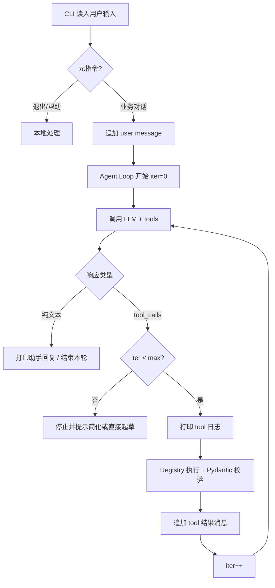
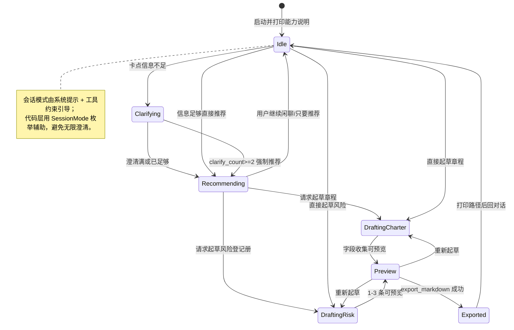

# PM Agent - 技术方案文档

---

## 0. 文档信息

- **项目名称**：PM Agent  
- **文档版本**：最终版 v1.0  
- **创建时间**：2026-07-14  
- **最近更新时间**：2026-07-14  
- **关联文档**：
  - PRD：`项目文档/PM-Agent/PM-Agent-MVP-PRD.md`
  - 技术调研文档：`项目文档/PM-Agent/TDD/PM-Agent-技术选型调研-2026-07-14.md`
  - 需求孵化：`docs/pm-agent/需求孵化.md`

---

## 1. 概述 (Overview)

> 产品背景与功能范围见 PRD，此处只写技术层。

### 1.1 技术目标

- **学习目标**：用可观察的自研 Agent Loop，跑通 感知→推理→行动→观察；对照书中循环控制、工具设计、错误回传为「指令」。
- **性能目标**：单用户、单进程；单次用户回合内工具迭代建议上限 **8～12**；导出文件毫秒～百毫秒级本地写盘。
- **可扩展性目标**：Tool Registry 可增工具；LLM Provider 可换（OpenAI 兼容）；后续可加渠道而不改核心 loop。
- **开发效率目标**：个人学习项目；阶段可演示；无前端/无微服务。
- **成本目标**：默认 DeepSeek；密钥本地配置；无云基础设施。
- **其他**：密钥不进导出；写盘路径白名单；可对纯函数（校验、渲染、路径）做 pytest。

### 1.2 关键技术选型理由

> 本产品无 Web 前端、无传统后端服务、无数据库。下表按「展示层 / 核心层 / 外部服务」映射模板中的前后端概念。

**展示层（等价「前端」）选型理由**：
- **形态**：CLI（标准库 `input()` / `print`）— 对齐 PRD；学习项目零 UI 框架噪音。
- **状态管理**：进程内 `SessionState`（messages + draft）— 关进程即丢，符合「无长期记忆」。
- **UI 组件库 / 样式 / 深色模式**：**不适用**（无 GUI）。

**核心层（等价「后端」）选型理由**：
- **语言**：Python 3.11+ — 学习摩擦力低；Agent 示例多；不要求对齐 `pm-toolbox`。
- **编排**：自研 Agent Loop — 练手核心；不上 LangChain/LangGraph。
- **数据库**：**不使用** — MVP 无跨会话持久化。
- **知识只读源**：`data/tools.json` — 从 toolbox 拷贝即可。
- **校验**：Pydantic — 校验 tool arguments。

**第三方服务选型理由**：
- **DeepSeek API**（`openai` Python SDK + `base_url`）— OpenAI 兼容 Tool Calls；成本友好；可切换兼容端。

> 详细对比见：`项目文档/PM-Agent/TDD/PM-Agent-技术选型调研-2026-07-14.md`

### 1.3 架构审校摘要（对应技能 2-6）

| 审查项 | 结论 |
|--------|------|
| ①「前后端」分离 | CLI 只负责 I/O；业务在 `agent/` + `tools/`；无 HTTP 耦合风险 |
| ② 解耦与模块化 | UI（cli）不直接读文件写盘；经 tools/execute；Tool 与 LLM client 分离 |
| ③ 极致裁剪 | 无 DB/无 Web/无 MCP/无向量记忆；避免重复造第二推荐服务 |

---

## 2. 系统架构 (Architecture)

### 2.1 整体拓扑图

```
┌─────────────────────────────────────────────┐
│                 CLI (展示层)                 │
│         input() / print / [tool] 日志        │
└──────────────────────┬──────────────────────┘
                       │ Session 消息
┌──────────────────────▼──────────────────────┐
│              Agent Core（核心层）             │
│  loop · llm_client · tool_registry · state   │
└───────┬──────────────────────────┬──────────┘
        │ tool_calls               │ Chat Completions + tools
        ▼                          ▼
┌─────────────────┐      ┌─────────────────────┐
│  Tools 实现层    │      │  DeepSeek / 兼容 LLM │
│  read json      │      │  (第三方)            │
│  update draft   │      └─────────────────────┘
│  write output/  │
└────────┬────────┘
         │
┌────────▼────────┐
│ 本地数据         │
│ tools.json      │
│ output/*.md     │
│ .env（密钥）     │
└─────────────────┘
```

**数据流向（单次用户输入）**：
1. CLI 读入用户文本 → 追加到 `messages`  
2. Loop 调 LLM（带 tools 定义）  
3. 若有 `tool_calls`：Registry 执行 → 结果以 tool 消息回填 → 再调 LLM  
4. 触顶或模型结束文本回复 → CLI 打印  
5. 用户要求导出时：`export_markdown` 写 `output/`

### 2.2 展示层架构（CLI）

- **架构模式**：对话 REPL（Read-Eval-Print Loop）  
- **模块划分**：`cli/main.py`（入口）、帮助/退出指令解析  
- **状态**：不另建前端 store；全部在 `SessionState`  
- **路由**：不适用；用意图分流（帮助/退出/交 Agent）  
- **构建工具**：`uv run` / `python -m pm_agent`

### 2.3 核心服务划分（单体进程）

- **服务架构**：单机单体 CLI 进程  
- **模块划分**：
  | 模块 | 职责 |
  |------|------|
  | `agent/loop.py` | 迭代上限、调模型、派发工具、可见日志 |
  | `agent/llm.py` | OpenAI 兼容客户端封装、错误分类 |
  | `agent/session.py` | messages、draft、clarify_count |
  | `tools/registry.py` | 注册/查找/执行、schema 导出给 LLM |
  | `tools/pm_*.py` | 各工具 execute |
  | `knowledge/tools_repo.py` | 加载/查询 tools.json |
  | `export/markdown.py` | 渲染章程/风险 Markdown |
- **服务边界**：工具层不调 LLM；LLM 层不直接写盘  
- **服务通信**：进程内函数调用（无 RPC）

### 2.4 解耦方案

- **展示与核心分离**：`cli` 只调用 `agent.handle_user_turn(text)`，不拼 prompt、不写文件。  
- **数据访问解耦**：`ToolsRepository` 抽象 JSON 读取；日后换 SQLite 只改 repo。  
- **业务与 I/O 解耦**：草稿变更经 draft 工具；落盘仅 `export_markdown`。

---

## 3. 详细设计 (Detailed Design)

### 3.1 核心逻辑流程图



### 3.2 状态机图



**SessionMode 枚举（建议）**：`idle` | `clarifying` | `recommending` | `drafting_charter` | `drafting_risk` | `preview`

### 3.3 关键算法

#### 算法 A：Agent 工具循环

- **适用场景**：每一轮用户业务输入  
- **思路**：`while iter < max_iterations`：请求 LLM → 无 tool_calls 则 break → 执行 tools → 追加结果  
- **输入**：`messages`, `tools_schema`, `max_iterations`  
- **输出**：最终助手文本；副作用为 draft/磁盘  
- **复杂度**：O(I × (T_llm + Σ tool))，I≤12  
- **边界**：空 tool_calls、非法 JSON arguments、未知工具名 → 回传纠正指令，不抛死进程

#### 算法 B：推荐结果白名单校验

- **适用场景**：`recommend_tools` 返回或模型口述工具后  
- **思路**：对每个 slug 查 `ToolsRepository`；过滤不存在项；若空则返回「请补充阶段」类指令  
- **输入**：候选 slug 列表  
- **输出**：合法工具摘要列表（≤3）  
- **复杂度**：O(k)，k≤3

#### 算法 C：Markdown 安全导出路径

- **适用场景**：`export_markdown`  
- **思路**：解析目标路径 → `resolve()` → 必须位于 `output_dir.resolve()` 之下 → 否则拒绝  
- **输入**：文档类型、草稿、可选文件名  
- **输出**：绝对路径字符串或错误指令  
- **边界**：目录不存在则创建；重名追加序号

### 3.4 异常处理流程

**错误处理策略**：
- **网络/API 错误**：超时、5xx → 有限次退避重试后，向用户提示「模型不可用，可稍后重试或直接说起草…」；401 → 提示检查密钥，不盲重试。  
- **业务错误**：不可填工具起草、非法 slug → 工具返回中文「不要做什么 / 应做什么」。  
- **系统错误**：未预期异常记日志 + 对用户友好短句；循环可中止本轮。

**边界情况**：
- **空输入**：CLI 层提示示例，不进 loop  
- **超时**：LLM 调用设 timeout（如 60s）  
- **并发**：单线程 REPL，不考虑并发写同一文件  
- **clarify 超限**：`clarify_count >= 2` 时系统提示强制进入推荐（代码可注入 reminder message）

---

## 4. 数据结构 (Data Schema)

### 4.1 存储策略说明

**MVP 不使用 SQL 数据库。** 数据形态：

| 存储 | 内容 | 生命周期 |
|------|------|----------|
| `data/tools.json` | 工具知识库 | 随仓库版本 |
| 内存 `SessionState` | 对话与草稿 | 进程内 |
| `output/*.md` | 导出产物 | 用户文件 |

下列「表结构」用 **Pydantic 模型**表达，便于日后若引入 SQLite 再映射 DDL。

### 4.2 核心模型（逻辑 Schema）

**PmTool（对应 tools.json 条目）**
- `slug`（str）主键语义  
- `name`, `name_en`, `process_group`, `knowledge_area`  
- `summary`, `description`, `steps: list[str]`, `scenarios: list[str]`  
- `template` / 可选 `template_fields` / `table_config`  

**SessionState**
- `messages: list[ChatMessage]`  
- `mode: SessionMode`  
- `clarify_count: int`  
- `charter_draft: CharterDraft | None`  
- `risk_draft: RiskRegisterDraft | None`  

**CharterDraft**（字段对齐 PRD/工具库）
- `project_name`, `sponsor`, `project_manager`, `business_case`, `high_level_scope`, `milestones`, `budget`, `risks`, `signature`（缺省 `"待补充"`）

**RiskItem**
- `risk_id`, `description`, `cause`, `probability`, `impact`, `score`, `response`, `owner`, `status`

**RiskRegisterDraft**
- `items: list[RiskItem]`（默认引导 1～3 条）

### 4.3 DDL 示例

```sql
-- MVP 不建库。若后续阶段引入 SQLite，示意如下（非本阶段实现）：
-- CREATE TABLE pm_tools (
--   slug TEXT PRIMARY KEY,
--   name TEXT NOT NULL,
--   process_group TEXT,
--   knowledge_area TEXT,
--   summary TEXT,
--   payload_json TEXT NOT NULL
-- );
```

### 4.4 缓存设计

- **策略**：进程内缓存已解析的 `tools.json`（启动加载一次即可）  
- **不做** Redis  

### 4.5 数据访问层

- **ToolsRepository**：`list_summaries()`, `search(keyword)`, `get_by_slug(slug)`, `exists(slug)`  
- **DraftStore**：挂在 `SessionState` 上的读写方法  
- **不设 ORM**

---

## 5. 接口定义 (API Specs)

> 无 HTTP API。契约分两类：**CLI 用户协议** 与 **Tool / LLM 协议**。

### 5.1 接口规范

- **风格**：进程内 Tool Calling（OpenAI function tools 形状）  
- **命名**：`snake_case` 工具名  
- **版本**：随仓库 semver；MVP 不版控 URL  
- **认证**：LLM 侧 API Key；CLI 无用户鉴权  

### 5.2 核心 Tool 契约

#### `search_tools`
- **描述**：按关键词检索工具库摘要  
- **参数**：`{ "query": string }`  
- **返回**（给模型的 content 文本/JSON 字符串）：最多 N 条 `{slug,name,summary,process_group,knowledge_area}`  

#### `recommend_tools`
- **描述**：根据用户卡点推荐 1～3 个库内工具；必须校验 slug  
- **参数**：`{ "question": string, "context": string? }`  
- **返回**：`{ reasoning, tools: [...] }`；非法 slug 已过滤；若空则带纠正指令  

#### `get_tool_detail`
- **参数**：`{ "slug": string }`  
- **返回**：步骤、场景、模板字段概要；未知 slug → 错误指令  

#### `draft_project_charter`
- **参数**：部分字段 patch（皆可选字符串）  
- **规则**：合并进 `charter_draft`；空值可写「待补充」  
- **返回**：当前草稿摘要  

#### `draft_risk_register`
- **参数**：`{ "items": RiskItem[] }` 或单条 upsert  
- **规则**：总数建议 ≤3（超过可警告但仍接受少量超额则截断或提示，**推荐：>3 时返回指令「MVP 请先保留 1～3 条」**）  
- **返回**：当前条目列表摘要  

#### `export_markdown`
- **参数**：`{ "doc_type": "charter" | "risk_register" }`  
- **返回**：`{ "path": "<abs or rel path>" }` 或写盘失败指令  
- **安全**：仅写 `OUTPUT_DIR`  

### 5.3 CLI「伪接口」

| 用户输入 | 行为 |
|----------|------|
| `/quit` `退出` | 结束进程 |
| `/help` `帮助` | 打印能力说明 |
| 其他文本 | `handle_user_turn` |

### 5.4 业务逻辑与日志

- **鉴权**：无多用户；导出路径白名单即「权限」  
- **业务规则**：可起草白名单仅 charter/risk；推荐必须库内工具；澄清 ≤2  
- **日志**：`[tool] name args_summary → ok|err`；API 错误类型；禁止打印完整 API Key  

---

## 6. 安全与部署 (Ops & Security)

### 6.1 环境变量配置

| 变量 | 说明 |
|------|------|
| `DEEPSEEK_API_KEY` | 默认 Provider |
| `DEEPSEEK_BASE_URL` | 默认 `https://api.deepseek.com` |
| `DEEPSEEK_MODEL` | 可配置模型 ID |
| `OPENAI_API_KEY` | 可选备用 |
| `OUTPUT_DIR` | 默认 `./output` |
| `MAX_TOOL_ITERATIONS` | 默认 `10` |

- `.env` 本地加载；示例用 `.env.example`（无真实密钥）  
- `.gitignore`：`.env`, `output/`, `__pycache__/`, `.venv/`  

### 6.2 目录结构

```
pm-agent/
├── README.md
├── pyproject.toml          # uv/pip 项目元数据
├── .env.example
├── .gitignore
├── data/
│   └── tools.json          # 自包含工具库
├── output/                 # 导出目录（gitignore）
├── src/
│   └── pm_agent/
│       ├── __init__.py
│       ├── __main__.py     # python -m pm_agent
│       ├── cli.py          # REPL
│       ├── config.py       # 环境变量
│       ├── agent/
│       │   ├── loop.py
│       │   ├── llm.py
│       │   ├── session.py
│       │   └── prompts.py  # 系统提示
│       ├── tools/
│       │   ├── registry.py
│       │   ├── search.py
│       │   ├── recommend.py
│       │   ├── detail.py
│       │   ├── draft_charter.py
│       │   ├── draft_risk.py
│       │   └── export_md.py
│       ├── knowledge/
│       │   └── repo.py
│       └── export/
│           └── render.py   # MD 模板渲染
└── tests/
    ├── test_repo.py
    ├── test_path_guard.py
    ├── test_draft_merge.py
    └── test_loop_limits.py
```

> 无 `client/` / `server/` 分仓；单体 `src/pm_agent` 内部分层即分离。

### 6.3 代码规范

- **风格**：`ruff` format + lint  
- **类型**：尽量加 type hints；Pydantic 模型边界  
- **测试**：pytest；优先测纯函数与路径守卫  
- **审查**：自学项目以 PRD 验收清单自检为主  

---

## 7. 附录

### 7.1 实现对照《从零到一造 Agent》

| 书中概念 | 本方案落点 |
|----------|------------|
| Agent Loop | `agent/loop.py` |
| 迭代上限 / 可见性 | `MAX_TOOL_ITERATIONS` + `[tool]` 日志 |
| 工具六字段 | Registry 中 name/description/parameters/category/pure/execute |
| 错误即指令 | tool 失败返回结构化中文指引 |
| 工具分层加载 | search 摘要 + get_tool_detail |
| 路径/副作用安全 | export 白名单；pure/impure 标记（并行非 MVP） |

### 7.2 参考资料

- DeepSeek Tool Calls 文档  
- Anthropic Build a tool-using agent（循环模式）  
- 本项目 PRD / 技术选型调研  

### 7.3 版本历史

| 版本 | 日期 | 说明 |
|------|------|------|
| v1.0 | 2026-07-14 | 基于 Python 选型与定稿 PRD 生成；同日随开发计划一并确认 |
